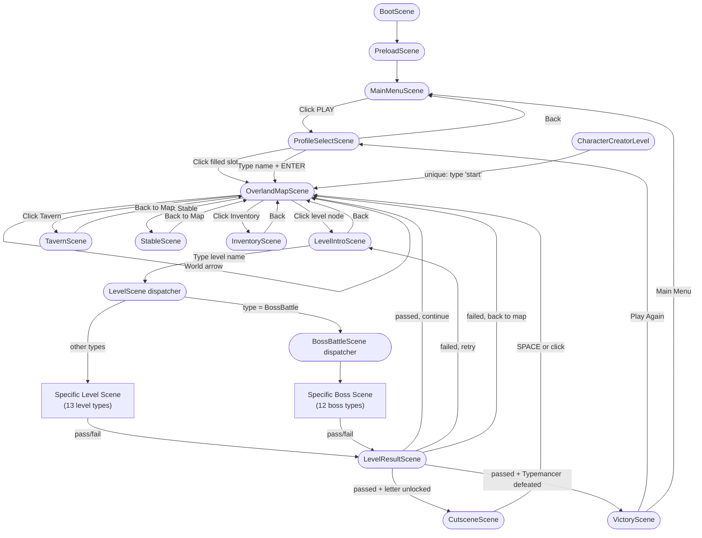

# Keyboard Quest — Scene Walkthrough & Flow Diagram

## Scene Flow Diagram

---

## Scene Reference

### Boot → Preload → Main Menu

| Scene | File | Purpose |
|-------|------|---------|
| `BootScene` | `src/scenes/BootScene.ts` | Initializes Phaser, immediately starts Preload |
| `PreloadScene` | `src/scenes/PreloadScene.ts` | Loads all game assets; shows progress bar |
| `MainMenuScene` | `src/scenes/MainMenuScene.ts` | Title screen with PLAY button |

**Flow:** Fully automatic until MainMenuScene. Player clicks **PLAY** to continue.

---

### Profile Selection

**Scene:** `ProfileSelectScene` (`src/scenes/ProfileSelectScene.ts`)

Displays 4 save slots:
- **Filled slot** — shows hero name, world, level. Click to load and go to Overland Map.
- **Empty slot** — shows "New Hero". Click to open inline name-entry mode. Type a name and press **ENTER** to create the hero and go to Overland Map.
  - Export/Delete buttons available on filled slots.
  - Import button available on empty slots.
- **Back button** — returns to Main Menu.

Hero naming happens **inline** in this scene — there is no separate name-entry scene.

---

### Overland Map

**Scene:** `OverlandMapScene` (`src/scenes/OverlandMapScene.ts`)

The central hub between levels. Shows a world map with clickable nodes.

**Node types:**
| Icon | Meaning |
|------|---------|
| Gold circle | Completed level |
| White circle | Available (unlocked) level |
| Gray circle | Locked level |
| Large circle | Boss / mini-boss node |
| 🔒 | Gated — boss gate star requirement not met |

**Stars displayed:** ⚡ speed stars + 🎯 accuracy stars for each completed level.

**Bottom navigation nodes:**
- **Tavern** → `TavernScene` (companion management)
- **Stable** → `StableScene` (pet management)
- **Inventory** → `InventoryScene` (equipment & stats)

**World navigation:** Arrows appear when adjacent worlds are unlocked. Clicking arrows restarts `OverlandMapScene` with the new world number.

**Mastery chest:** Appears when all levels in the current world average 3+ combined stars. Claim once per world for a reward item.

---

### Level Intro Gate

**Scene:** `LevelIntroScene` (`src/scenes/LevelIntroScene.ts`)

Displays the level name and a short story beat. The player must **type the level name** (letters only, lowercase, spaces ignored) to enter.

- Correct key → character highlights green, progress advances.
- Wrong key → screen flashes red, no progress.
- All letters typed → 200ms delay, then transitions to `LevelScene`.

Example: "Alder Falls" becomes target string `"alderfalls"`.

---

### Level Dispatcher

**Scene:** `LevelScene` (`src/scenes/LevelScene.ts`)

A thin routing scene. Reads `LevelConfig.type` and immediately starts the matching scene:

| `LevelConfig.type` | Scene Started |
|--------------------|---------------|
| `CharacterCreator` | `CharacterCreatorLevel` |
| `GoblinWhacker` | `GoblinWhackerLevel` |
| `SkeletonSwarm` | `SkeletonSwarmLevel` |
| `MonsterArena` | `MonsterArenaLevel` |
| `UndeadSiege` | `UndeadSiegeLevel` |
| `SlimeSplitting` | `SlimeSplittingLevel` |
| `DungeonTrapDisarm` | `DungeonTrapDisarmLevel` |
| `DungeonEscape` | `DungeonEscapeLevel` |
| `PotionBrewingLab` | `PotionBrewingLabLevel` |
| `MagicRuneTyping` | `MagicRuneTypingLevel` |
| `MonsterManual` | `MonsterManualLevel` |
| `WoodlandFestival` | `WoodlandFestivalLevel` |
| `SillyChallenge` | `SillyChallengeLevel` |
| `GuildRecruitment` | `GuildRecruitmentLevel` |
| `BossBattle` | `BossBattleScene` (another dispatcher) |

---

### Level Scenes (`src/scenes/level-types/`)

All regular level scenes use the **TypingEngine** component for core input. Players type words to progress. Common elements:

- Word queue drawn from a filtered word bank
- Character/enemy sprites and HP bars
- Optional **GhostKeyboard** (visual keyboard overlay)
- Optional **TutorialHands** (finger placement hints)
- **SpellCaster** for spell usage
- Timer (if `level.timeLimit` is set)
- Player HP (usually 3); drops to 0 = fail

All level scenes end by calling `scene.start('LevelResultScene', { passed, accuracyStars, speedStars, ... })`.

#### Special Case: CharacterCreatorLevel

The very first level. Player types `"start"` to create their character. **Unique behavior:** transitions directly to `OverlandMapScene`, bypassing `LevelResultScene`. This means `unlockNextLevels()` is never called — a known bug that leaves w1_l2 locked after character creation.

#### MonsterManualLevel

Teaches the player a boss's weakness. On completion, sets `profile.bossWeaknessKnown = bossId`. The corresponding boss fight will reduce boss HP by 20%.

---

### Boss Battle Dispatcher

**Scene:** `BossBattleScene` (`src/scenes/BossBattleScene.ts`)

Routes `LevelConfig.bossId` to the specific boss scene:

| `bossId` | Scene Started |
|----------|---------------|
| `grizzlefang` | `GrizzlefangBoss` |
| `knuckle_keeper_of_e` | `MiniBossTypical` |
| `nessa` | `MiniBossTypical` |
| `rend_the_red` | `MiniBossTypical` |
| `hydra` | `HydraBoss` |
| `slime_king` | `SlimeKingBoss` |
| `clockwork_dragon` | `ClockworkDragonBoss` |
| `baron_typo` | `BaronTypoBoss` |
| `spider` | `SpiderBoss` |
| `tramun_clogg` | `FlashWordBoss` |
| `badrang` | `FlashWordBoss` |
| `bone_knight` | `BoneKnightBoss` |
| `dice_lich` | `DiceLichBoss` |
| `ancient_dragon` | `AncientDragonBoss` |
| `typemancer` | `TypemancerBoss` |

---

### Boss Scenes (`src/scenes/boss-types/`)

Boss scenes have richer mechanics than regular levels:

- **Boss HP bar** + **Player HP bar** displayed
- Player HP is usually **5** (vs 3 in regular levels)
- **Weakness system:** If `profile.bossWeaknessKnown` matches this boss's ID, boss spawns with 20% fewer HP
- **Phases:** Multi-phase bosses (e.g., GrizzlefangBoss) change behavior mid-fight
- End states: Boss HP = 0 → pass; Player HP = 0 → fail

**TypemancerBoss** is the final boss. Defeating it triggers the Victory path in `LevelResultScene`.

---

### Level Result

**Scene:** `LevelResultScene` (`src/scenes/LevelResultScene.ts`)

Processes the result of any level (regular or boss). Receives: `passed`, `accuracyStars`, `speedStars`, and optional `captureAttempt`.

#### Victory path (`passed = true`)

1. Award XP based on stars earned
2. Update character level if XP threshold crossed
3. Save `levelResults[levelId]` (only overwrites if better total stars)
4. Award unlocked items, spells, and titles
5. Check **Solo Scribe** title (all bosses done solo, no companion)
6. Call `unlockNextLevels()` — unlock next level in sequence
7. Handle mini-boss letter unlock → may transition through `CutsceneScene`
8. **If Typemancer defeated:** show "THE TYPEMANCER IS DEFEATED!" then after 2s go to `VictoryScene`
9. Otherwise: show VICTORY screen with stars and XP gained
10. **Continue** button → `CutsceneScene` (if letter unlocked) or `OverlandMapScene`

#### Defeat path (`passed = false`)

- Show "DEFEATED" message
- **Retry** button → back to `LevelIntroScene` (same level)
- **Map** button → `OverlandMapScene`

#### Capture mechanics

If `captureAttempt` is provided and level is capture-eligible:
- Base ~20% capture chance
- Lucky Charm accessory increases chance
- If successful: adds pet to profile (no duplicates)
- At 10+ pets: awards **Beast Tamer** title

---

### Cutscene

**Scene:** `CutsceneScene` (`src/scenes/CutsceneScene.ts`)

A brief story moment shown after defeating a mini-boss and unlocking a new letter key.

- Displays a large gold letter (e.g., **E**) with a pulsing glow
- Shows unlock title (e.g., "Seeker of E")
- `TutorialHands` highlights that letter on an on-screen keyboard
- **SPACE or click** → advances to `nextScene` (usually `OverlandMapScene`)

---

### Victory

**Scene:** `VictoryScene` (`src/scenes/VictoryScene.ts`)

Shown only after defeating the Typemancer (final boss).

- Fireworks particle animation
- "YOU WON!" with hero stats: name, level, XP, titles earned, companion/pet counts
- **Play Again** → `ProfileSelectScene`
- **Main Menu** → `MainMenuScene`

---

### Utility Scenes

#### TavernScene (`src/scenes/TavernScene.ts`)
Manage companions. Companions auto-strike enemies during levels.
- View owned companions (3-column grid); click to set active (highlighted with green ✓)
- Recruit new companions from available templates
- **Back to Map** → `OverlandMapScene`

#### StableScene (`src/scenes/StableScene.ts`)
Manage captured pets. Pets are obtained via the capture mechanic in eligible levels.
- View captured pets (4-column grid); click to set active
- No recruitment — pets are capture-only
- **Back to Map** → `OverlandMapScene`

#### InventoryScene (`src/scenes/InventoryScene.ts`)
Equip items and allocate stat points.
- **Equipment slots:** Weapon, Armor, Accessory. Click to open a selection modal.
- **Character stats:** Level, HP, Power, Focus. Use [+] buttons to spend `statPoints`.
- **Owned spells:** Display only (no interaction).
- **Back** → `OverlandMapScene`

---

## World & Level Structure

The game has **5 worlds**, each containing:
- 2–3 regular typing levels
- 3–4 mini-boss fights (each unlocks a new letter for the word bank)
- 1 final world boss (defeating unlocks the next world)

### Letter Unlock System

Letters are progressively unlocked as the player defeats mini-bosses. The word bank expands with each new letter, increasing difficulty:

| Source | Example Letters |
|--------|----------------|
| Starting letters (home row) | a, s, d, f, j, k, l |
| Mini-boss unlocks | e, n, r, o, t, i, … |

### Boss Gate System

Some levels have a `bossGate` requirement. The level node shows 🔒 and is unclickable until the player achieves an average star rating of N across specified prerequisite levels.

### Mastery Rewards

When all levels in a world collectively reach 3+ combined stars, a chest icon appears on the Overland Map. Claiming it once awards a trophy item.

---

## Data Persistence

All progress is stored in **localStorage** with no backend:

| Key | Contents |
|-----|---------|
| `kq_profile_0` | Save slot 0 |
| `kq_profile_1` | Save slot 1 |
| `kq_profile_2` | Save slot 2 |
| `kq_profile_3` | Save slot 3 |

Key profile fields: `unlockedLevelIds`, `levelResults`, `currentWorld`, `equipment`, `companions`, `pets`, `spells`, `titles`, `statPoints`, `bossWeaknessKnown`.

Profiles can be **exported** as `.kq` JSON files and **imported** back via the ProfileSelectScene.

---

## Known Issues

| Issue | Location | Impact |
|-------|----------|--------|
| `CharacterCreatorLevel` skips `LevelResultScene` | `src/scenes/level-types/CharacterCreatorLevel.ts` | `unlockNextLevels()` never runs; new heroes can't unlock w1_l2 via normal play |
